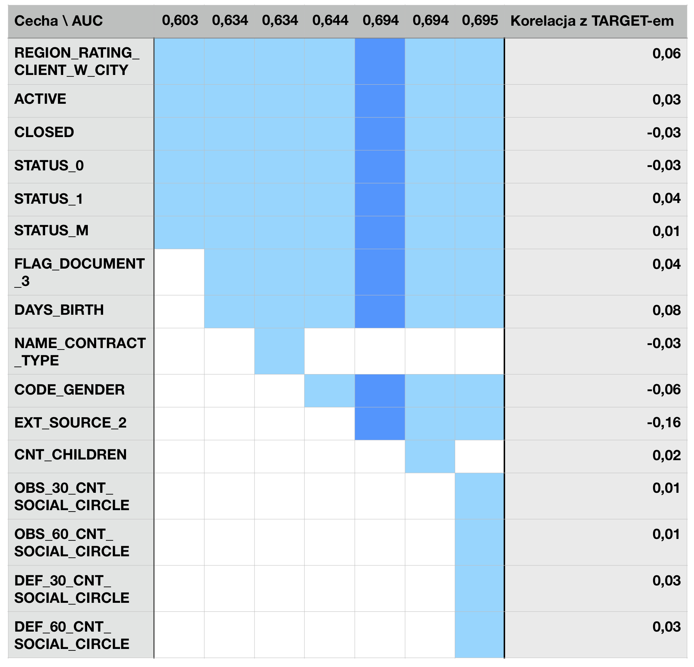
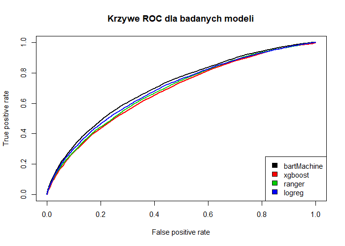
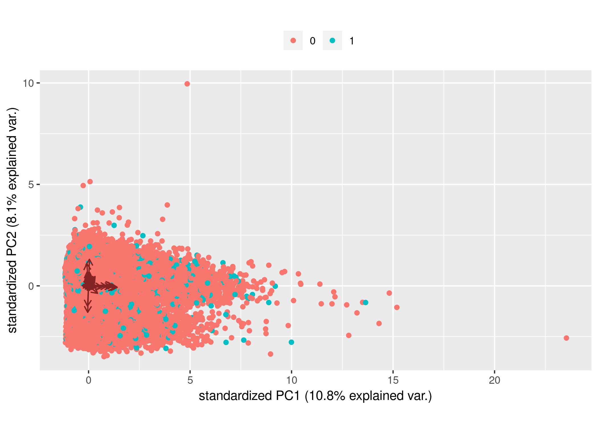

# Wyciągnięcie danych z plików


Wyekstraktowane za pomocą one-hot-encodingu, grupowania i innych metod cechy:

* **STATUS_0** do **STATUS_5** -- określają ile było rat pożyczek o danym opóźnieniu w miesiącach,
* **STATUS_X** -- określa o ilu miesiącach nie mamy informacji,
* **SUM_MONTHS** -- określa, jak długo sumarycznie trwały wszystkie pożyczki dotąd,
* **SUM_LATE_MONTHS** -- określa, ile sumarycznie w miesiącach wynoszą opóźnienia w spłacie,
* **RATIO_LATE_MONTHS** -- iloraz **SUM_MONTHS** przez **SUM_LATE_MONTHS**,
* **ACTIVE**, **CLOSED**, **BAD_DEBT**, **SOLD**, **UNKNOWN_STATE** -- określa, ile klient posiadał pożyczek o danym stanie,
* **CASH_LOANS**, **CONSUMER_LOANS**, **REVOLVING_LOANS**, **UNKNOWN_TYPE_LOANS** -- określa, ile klient posiadał pożyczek o danym typie.

Odrzuciliśmy klientów bez historii kredytowej. Odrzuciliśmy też cechy z za dużą liczbą *NA*.

 ---

# Wybieranie cech



 ---

# Porównanie modeli
Wybrane modele:

* bartMachine - Bayesian Additive Regression Trees
* logreg - Logistic Regression
* ranger - Random Forests
* xgboost - eXtreme Gradient Boosting



```{r porownaniemodeli, echo=FALSE, warning=FALSE, fig.width=10, fig.height=7, fig.align='center'}
library(ggplot2)
modele <- data.frame(Model=c("logreg","ranger","bartMachine","xgboost"), AUC=c(0.694, 0.686, 0.708,0.679))

ggplot(modele, aes(x=Model, y=AUC, label=AUC)) + 
  geom_col(fill="lightblue",color="black") + 
  geom_label() +
  scale_y_continuous(breaks=seq(0,0.8,by=0.1))+
  labs(title="Porównanie modeli względem AUC")


```

 ---

# PCA

```{r pca, echo=FALSE, fig.width=10, fig.height=7, fig.align='center'}
library(ggplot2)
library(forcats)
pca_imp <- read.csv("pca_imp.csv")
ggplot(data = pca_imp, aes(x = fct_reorder(X, Proportion.of.Variance, .desc = TRUE), 
                           y = Cumulative.Proportion)) +
  geom_bar(stat="identity", fill = "#00BFC4") +
  geom_bar(aes(y = Cumulative.Proportion-Proportion.of.Variance), stat = "identity", fill = "darkgrey") +
  scale_x_discrete(labels = 1:50) +
  ylab("Cumulative proportion") +
  xlab("Component") +
  ggtitle("Proporcja wariancji pomiędzy składowymi PCA")

```



Skuteczność regresji logistycznej na pierwszych 25 kolumnach i pozostałych factorach: **0.703613**.
