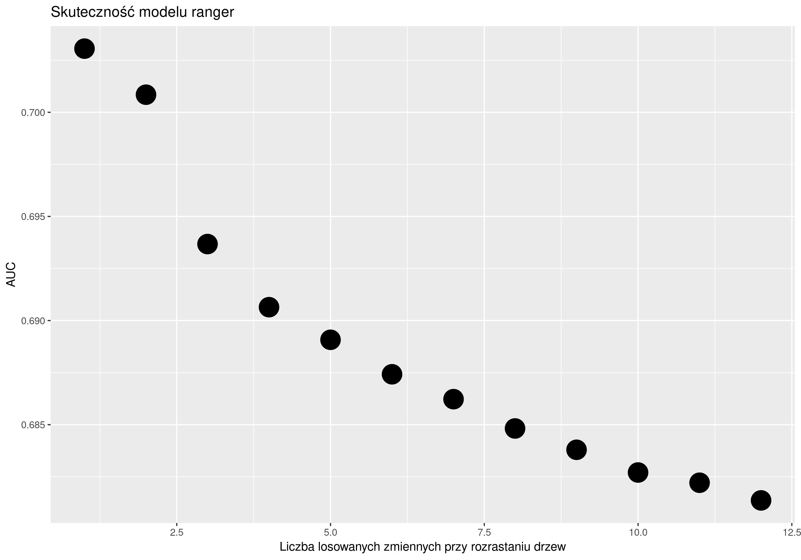
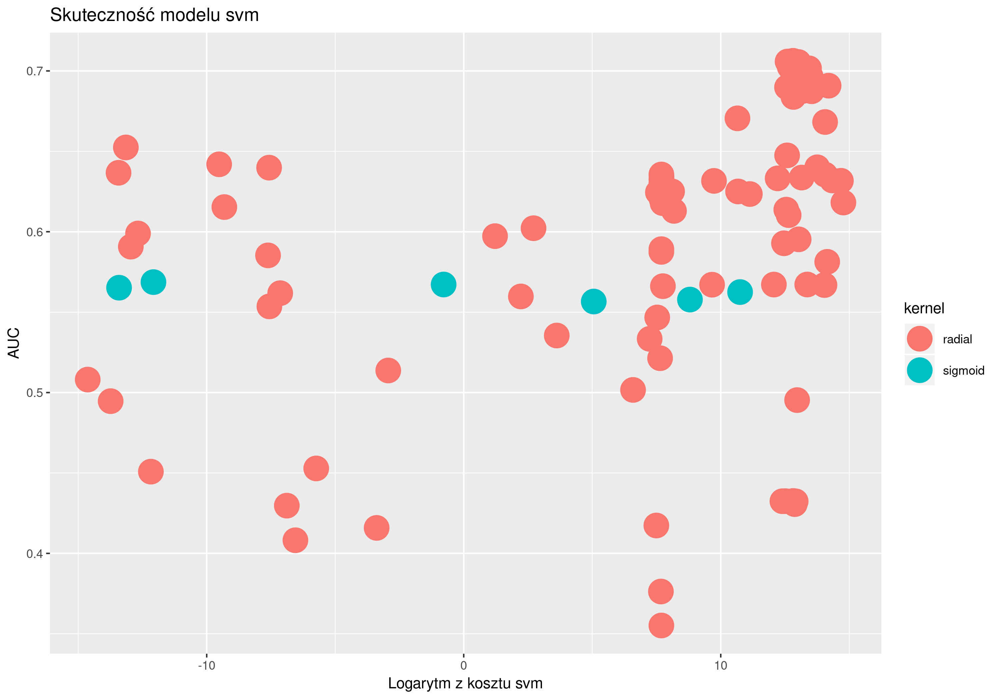
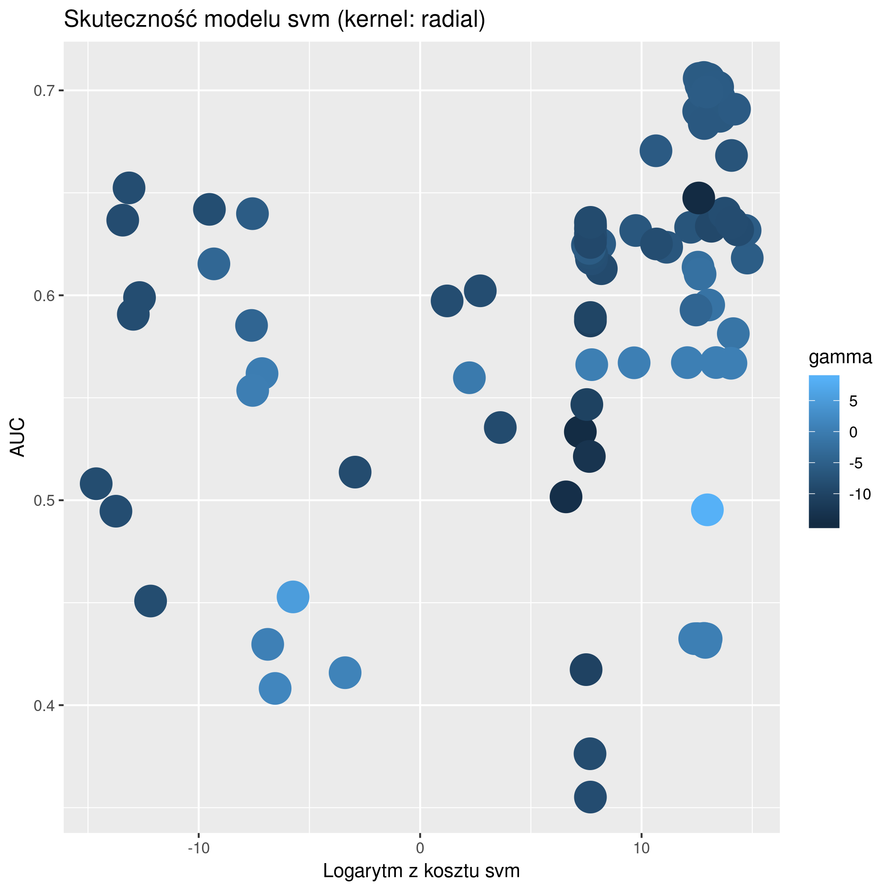
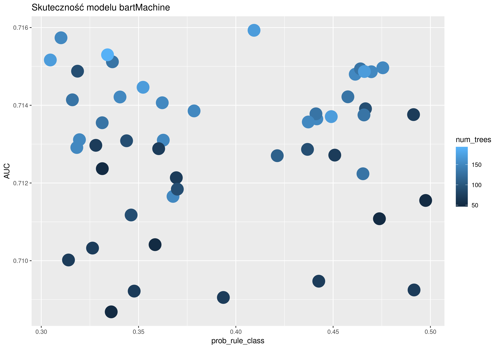
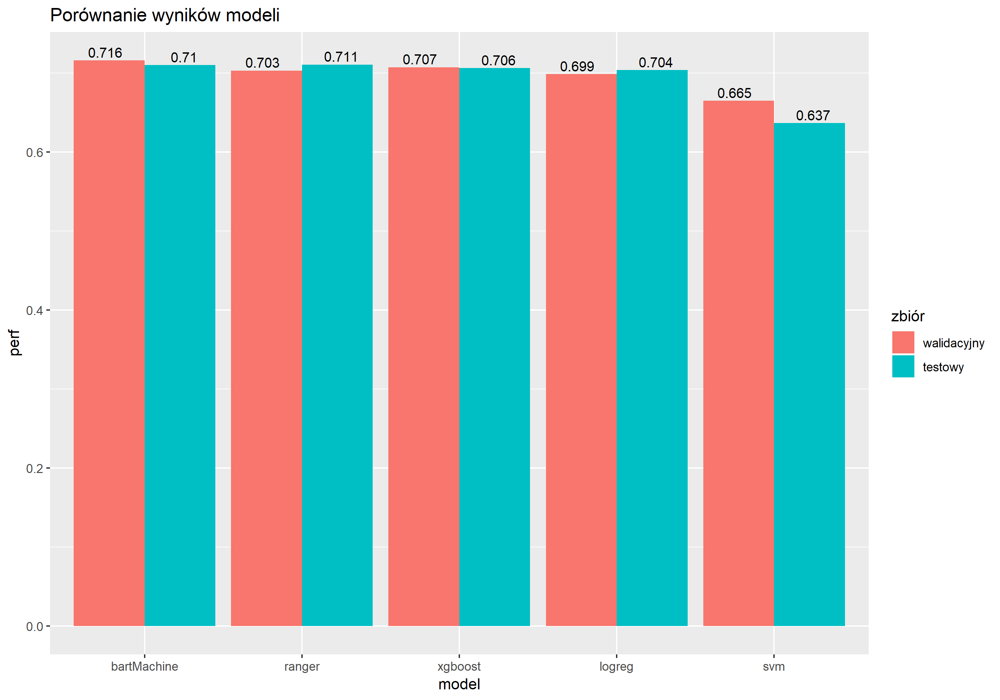

# Ostatecznie wybrane cechy:

* ACTIVE
* CLOSED
* STATUS_0
* STATUS_1
* STATUS_M
* FLAG_DOCUMENT_3
* DAYS_BIRTH
* CODE_GENDER
* EXT_SOURCE_2
* **AMT_CREDIT**
* **AMT_GOODS_PRICE**

 ---
 
# Porównanie modeli
Wybrane modele:

* bartMachine - Bayesian Additive Regression Trees
* logreg - Logistic Regression
* ranger - Random Forests
* xgboost - eXtreme Gradient Boosting
* **svm** - Support Vector Machine

Strojenia hiperparametrów dokonywaliśmy, ćwicząc modele na zbiorze testowym, a sprawdzając wyniki na zbiorze walidacyjnym. Na końcu, dla najlepszych hiperparamtrów, popatrzyliśmy na wyniki na zbiorze testowym.

## logreg

Metoda: skalowanie i standaryzacja niektórych zmiennych

Auc na zbiorze testowym: **0,705**

## ranger

Metoda: strojenie hiperparamentrów dla 500 drzew na całym zbiorze treningowym przy pomocy funkcji makeTuneControlGrid(resolution = 12L) (mieliśmy tylko 12 zmiennych)

Optymalne hiperparametry: mtry = 1 

Auc na zbiorze testowym: **0,710**

## svm

Metoda: stojenie hiperparametrów przy pomocy optymalizacji opartej na modelu - pakiet mlrMBO. 
Zakres parametrów: 
* kernel: linear, polynomial, radial, sigmoid, 
* cost: 2e-15 -- 2e15
* gamma (dla kernel = radial): 2e-15 -- 2e15
* degree (dla kernel = polynomial): 1 -- 4

Optymalne hiperparametry: kernel = linear, cost = 0,843

Auc na zbiorze testowym: **0,637**

## bartMachine

Metoda: strojenie hiperparametrów na całym zbiorze treningowym, za pomocą funkcji makeTuneControlRandom() z 50 iteracjami

Zakres parametrów: 
* num_trees: 50 -- 190 
* k: 1 -- 5
* q 0.4 -- 0.9
* prob_rule_class: 0.3 -- 0.5

Optymalne hiperparametry:  num_trees = 170, k = 3,75, q = 0,5, prob_rule_class = 0,409 

Auc na zbiorze testowym = **0,71**

## xgboost

Metoda: strojenie hiperparametrów na podzbiorze zbioru treninowego, za pomocą funkcji makeTuneControlRandom() z 100 iteracjami

Optymalne hiperparametry: eta (learning rate) = 0,105, nrounds = 251, max_depth = 2

Auc na zbiorze walidacyjnym: **0,707**

# Ostatecznie wybrany model

