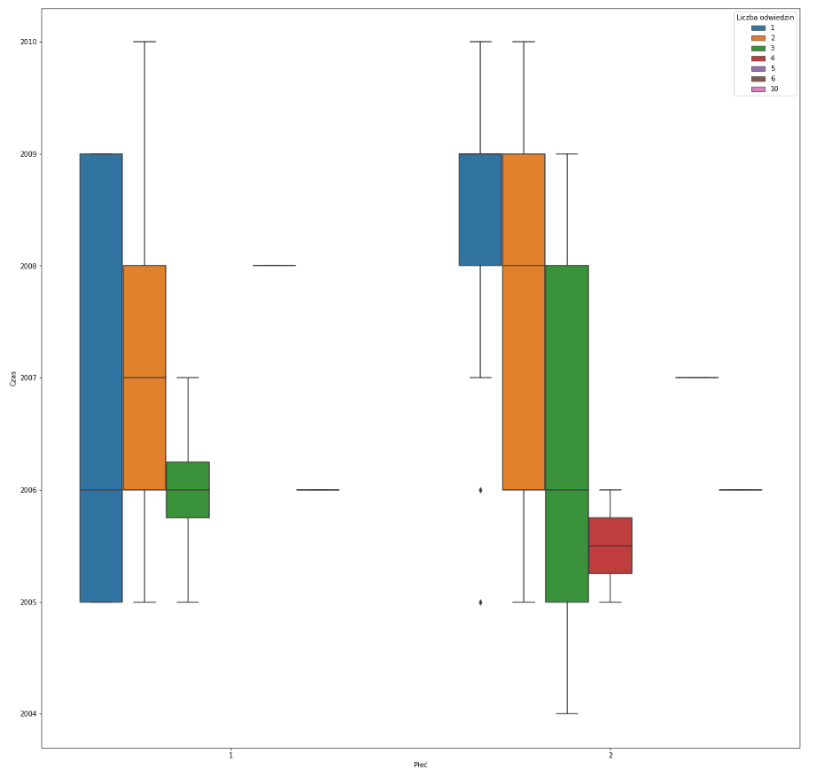

```{r, echo = FALSE, message=FALSE}
library(readr)
library(dplyr)
library(ggplot2)
library(knitr)
library(visdat)
library(DataExplorer)
require(gridExtra)
library(scales)
library(e1071)
load("Plots.rda")
```

# Wstęp 

W tej pracy spróbuję poprawić kilka wizualizacji, a także przedstawić argumenty za tym, dlaczego moim zdaniem moje wykresy są lepsze od oryginalnych.

# Rydelek-Merkel-Stawikowski

Przedtem wyglądało to tak:


W moim wykonaniu wykres wygląda następująco:

```{r, echo = FALSE}
rydelek
```

Opis:

Wykres jest bardzo podobny do oryginału w tym, że na osi pionowej znajduje się zmienna "chol" i kolejne cztery klasy 0, 1, 2 i 3 "Thal", mają takie samo ułożenie na wykresie, od lewej do prawej. Różnicą jest podział wykresu na cztery zmienną "Thal". Zmienna "trestbps" nie odpowiada już za wielkość okręgu przedstawiającego obserwację, a jest zamiast tego osią poziomą na każdym z wykresów.

Zalety mojego wykonania:

- wykres jest czytelny:

  - Teraz widać dokładnie wartość "trestbps",

  - widać także dla każdego punktu dokładną wartość chol, która ginęła w gąszczu okręgów,

- zachowuje ład pierwowzoru ("Thal" 0,1,2,3 ustawione są w kolejności od lewej do prawej)

Eksperymentowałem również z umieszczeniem wszystkiego na jednym wykresie z kolorowaniem
klas "thal", ale efekt jest bardzo mało czytelny.

# Werner-Jastrzębski-Gajewska

Wykres przed:



Oto jak przedstawia się poprawiony wykres:

```{r, echo = FALSE, fig.width=10}
gajewska
```

Oryginalny wykres był po pierwsze bardzo nieklasyczny i wymagał chwili zastanowienia, by dojść do tego, co właściwie przedstawia, a po drugie kładł nacisk na złą zmienną - "płeć".

Poprawiony wykres można bardzo łatwo interpretować. Kolejne wykresy od prawej odpowiadają dzieciom urodzonym w kolejnych latach (czyli najstarsi są po lewej).
Każdy z wykresów przedstawia histogram zmiennej: "Który raz uczestnik eksperymentu jest w Centrum nauki Kopernik?". Widać także, jak rozkłądały się klasy płci.

Zalety:

- duża czytelność,

- wykres bardzo szybko wyraża wszystkie informacje, które wyrażał poprzedni, bez zbędnego komplikowania formy,

- zamiast boxplotu mamy pełne histogramy, mniejsza utrata informacji,

- jeżeli nie patrzy się na płeć, wykresy przedstawiają po prostu histogramy. Na poprzednim wykresie nie można było odczytać zsumowanych wyników po płciach.

# Hubert (box ploty w czasie)

Wykres przed:


Oto moja poprawiona wersja:

```{r, echo=FALSE, fig.height= 17}
hubert
```

Wykres Huberta był bardzo skompresowany.
Teraz można przyjżeć się wszystkim rozkładom dokładnie.

Zalety:

- Wszytko widać jak na dłoni

Wady:

- zajmuje dość dużo miejsca 


# Badanie symetrii

Badanie symetrii to to samo, co badanie antysymetrii. Dobrą sprawdzoną miarą statystyczną jest np. skośność. 

Skośność Pearsona liczymy w następujący sposób:

$$ Skewness = E[(\frac{X - \mu}{\sigma})^3] = \frac{E[(X - \mu)^3]}{(E[(X - \mu)^2])^{\frac{3}{2}}}$$

A teraz przedstawię kilka przykładów działania miary skośności.

Oto bardzo skośne dane:

```{r}
x <- rnorm(100000)
x <- exp(x)
ggplot(data.frame(x = x), aes(x)) + geom_histogram(bins = 100) + theme_minimal()
```

Zobaczmy, ile wynosi skośność:

```{r}
skewness(x)
```

Skośność jest duża (bardzo różna od zera). Czyli umiemy wykryć asymetrię. 
Tym razem policzmy dla takich danych:
```{r}
x <- rnorm(100000)
x <- -exp(x)
ggplot(data.frame(x = x), aes(x)) + geom_histogram(bins = 100) + theme_minimal()
```

Skośność:

```{r}
skewness(x)
```

Dużo mniejsze od zera. Ok. A teraz symetryczne dane:
```{r}
x <- rnorm(100000) + 5
ggplot(data.frame(x = x), aes(x)) + geom_histogram(bins = 100) + theme_minimal()
```
Skośność:
```{r}
skewness(x)
```

bliska zeru, czyli rozkład symetryczny.

Przykład nietypowy:

```{r}

x <- c(rep(1, 1000), rep(2, 200), rep(3, 1000), rep(4,200))
ggplot(data.frame(x = x), aes(x)) + geom_histogram(bins = 100) + theme_minimal()
```
Skośność:
```{r}
skewness(x)
```

Bardzo mała. Czy to oznacza, że skośność będzie źle działała? Gdyby się zastanowić, rozkład ten nie różni się wiele od:

```{r}
x <- c(rep(0,200), rep(1, 1000), rep(2, 200), rep(3, 1000), rep(4,200))
ggplot(data.frame(x = x), aes(x)) + geom_histogram(bins = 100) + theme_minimal()
```

który jest symetryczny.

Moje wnioski: Skośność nie jest może miarą idealną, ale w bardzo wielu przypadkach sprawdzi się bardzo dobrze.

