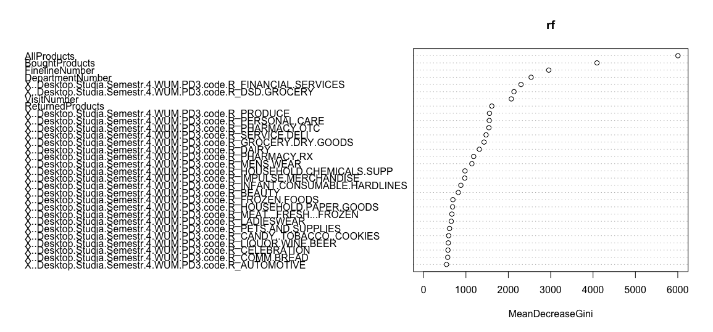

```{r setup, include=FALSE}
knitr::opts_chunk$set(echo = TRUE)
# libraries
library(mlr)
library(dplyr)
library(tidyr)
library(caret)
library(dummies)
library(forcats)
library(BBmisc)
library(randomForest)
blad <- 0.92828469
blad_przed <- 1.95708506
# Są to wyniki otrzymane po odpaleniu code.R, ale próba odpalenia raport.Rmd, kończy się całonocnymi obliczeniami, które nawet wtedy się nie kończą.
```

```{r include=FALSE, cache=TRUE, eval = FALSE}
# data
set.seed(1)
train <- read.csv("train.csv")

modelsFull1 <- cbind(train, dummy(train$DepartmentDescription, sep = "_"))
modelsFull2 <- modelsFull1

################################################################################################################

train_dummy1 <- na.omit(train[1:95674, ])
train_dummy1$TripType <- as.factor(train_dummy1$TripType)
train_dummy1$DepartmentDescription <- fct_lump(train_dummy1$DepartmentDescription, 50)

train_dummy <- train_dummy1[1:75050, ]
test_dummy <- train_dummy1[75051:95078, ]

rf_dummy <- randomForest(TripType ~ ., data=train_dummy)
scores_dummy <- predict(rf_dummy, test_dummy, type = "prob")

myScores_dummy <- sapply(1:nrow(test_dummy), function(i){
  scores_dummy[i, test_dummy$TripType[i]]
})

blad_dummy <- mean(-log(pmax(myScores_dummy,0.05)))


################################################################################################################

data1 <- modelsFull1 %>% 
  group_by(VisitNumber) %>%
  summarise(TripType = as.factor(head(TripType,1)),
            AllProducts = sum(ScanCount),
            BoughtProducts = sum(ScanCount >= 0),
            ReturnedProducts = sum(ScanCount < 0),
            DepartmentNumber = n_distinct(DepartmentDescription),
            FinelineNumber = n_distinct(FinelineNumber)
  )

data2 <- select(modelsFull2, -c(1,3,4,5,6,7)) %>%
  group_by(VisitNumber) %>%
  summarise_all(sum)

data1 <- as.data.frame(data1)
data2 <- as.data.frame(data2)
  
data <- data.frame(merge(data1, data2, by = "VisitNumber"))

train <- data[1:75750, ]
test <- data[75751:95674, ]

rf <- randomForest(TripType ~ ., data=train)
scores <- predict(rf, test, type = "prob")

myScores <- sapply(1:nrow(test), function(i){
  scores[i, test$TripType[i]]
})

blad <- mean(-log(pmax(myScores,0.05)))
```

# Wprowadzenie

Chciałbym pokazać porównanie między modelem zbudowanym na danych podanych, a modelem zbudowanym na danych stoworzonych przeze mnie na podstawie danych podanych. Jako wyznacznik będę uważał, błąd podany w treści zadania.

W całym zadaniu będę używał algorytmu lasów losowych: `randomForest`. Dane prezentują się następująco:

```{r}
train <- read.csv("train.csv")
modelsFull1 <- cbind(train, dummy(train$DepartmentDescription, sep = "_"))
modelsFull2 <- modelsFull1
train
```


# Model zbudowany na raw_data

W związku z tym, że `randomForest` nie działa, gdy jakaś kolumna kategoryczna ma więcej niż 53 poziomy, zdecydowałem się do ograniczenia ilości poziomów `DepartamentDescription` do 51, wykonałem to sposobem z poprzedniej pracy domowej (za pomocą funkcji `fct_lump()` z pakietu `forcats`). W celach uczenia i testowania modelu, podzieliłem zbiór danych w proporcji *75/25*. Dzięki temu wytrenowałem model i byłem w stanie obliczyć błąd. Wyszedł on całkiem duży.

```{r}
blad_przed
```

# Model zbudowany po feature engineering'u

W celu polepszenia jakości predykcji zdecydowałem się, stworzyć pięć nowych kolumny:

* `AllProducts` - ile wszystkich produktów brało udział w tranzakcji,
* `BoughtProducts` - ile produktów kupiono w danej tranzakcji,
* `ReturnedProducts` - ile produktów zwrócono w danej tranzakcji,
* `DepartmentNumber` - numer świadczący o tym, w ilu departamentach robione były zakupy,
* `FinelineNumber` - numer świadczący o tym, ile finelinenumber brało udział w tranzakcji.

Połączyłem to jeszcze z przekodowanymi zmiennymi, dotyczącymi `DepartamentDescription`. To tego kodowania użyłem `dummy Variables` z pakietu `dummies`. Na uzyskanych w ten sposób zmiennych zrobiłem jeszcze agregacje, która pokazuje ile raz konkretny departament był odwiedzany w każdej tranzakcji.

Dane prezentują się następująco:

```{r, cache=TRUE}
data1 <- modelsFull1 %>% 
  group_by(VisitNumber) %>%
  summarise(TripType = as.factor(head(TripType,1)),
            AllProducts = sum(ScanCount),
            BoughtProducts = sum(ScanCount >= 0),
            ReturnedProducts = sum(ScanCount < 0),
            DepartmentNumber = n_distinct(DepartmentDescription),
            FinelineNumber = n_distinct(FinelineNumber)
  )

data2 <- select(modelsFull2, -c(1,3,4,5,6,7)) %>%
  group_by(VisitNumber) %>%
  summarise_all(sum)

data1 <- as.data.frame(data1)
data2 <- as.data.frame(data2)
  
data <- data.frame(merge(data1, data2, by = "VisitNumber"))

data
```


Dzięki temu udało mi się wytrenować nowy model i przeprowadzić kolejne testy. Tym razem błąd wyszedł.

```{r}
blad
```

Jak widzimy wyszedł mniejszy o ponad 1. Biorąc pod uwagę to w jaki sposób błąd jest wyliczany można powiedzieć, że jest to znacząca poprawa.

# Podsumowanie

Widzimy, że feature engineering znacznie polepszył jakość naszej predykcji. Sprawdźmy wykres ważnosći poszczególnych zmiennych, aby to zweryfikować.

```{r}

```

Jak widać z wykresu, najważniejsze są zmienne, które zostały stworzone przeze mnie, zatem wiemy, że polepszenie błędu nie jest przypadkiem.