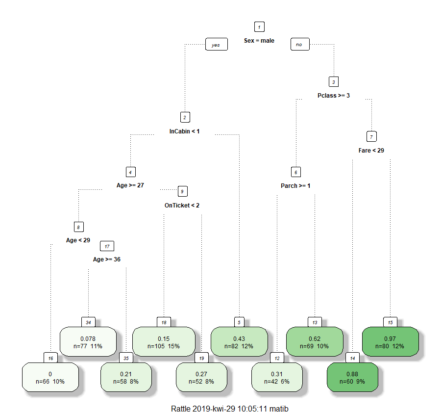
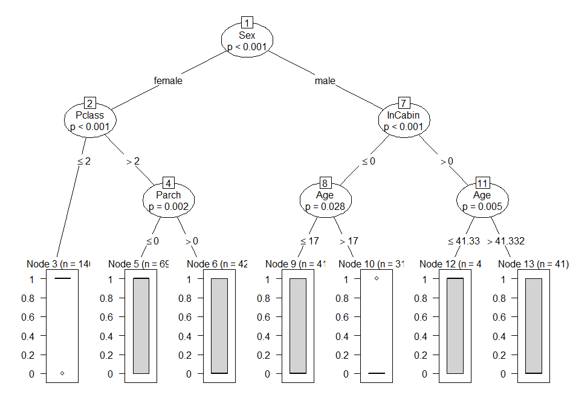

```{r setup, include=FALSE}
knitr::opts_chunk$set(echo = TRUE)

# libraries ----
require(titanic)
require(ranger)
require(missRanger)
require(dplyr)
require(randomsearch)
set.seed(27)

# datasets ----
test_indices <- sample(1:nrow(titanic_train), 200)
titanic_test <- titanic_train[test_indices, ]
titanic_train <- titanic_train[-test_indices, ]
rm(test_indices)
```

# Wstęp

Poniższy dokument poświęcony jest porównaniui drzew decyzyjnych z różnymi hiperparametrami dla zbioru danych `titanic`. Stworzone modele drzew będą pochodzić z bibliotek `ranger`, `rpart` oraz `partykit`.

# Preprocessing

Pochodzący z serwisu Kaggle zbiór `titanic` był wprawdzie podzielony na zbiory uczący i testowy, jednak ten drugi nie zawierał etykiet, które są niezbędne do ewaluacji modeli. W związku z tym ze zbioru uczącego wycięte zostało 200 losowo wybranych obserwacji, które ustanowiły nowy zbiór testowy.

Następnie obydwa zbiory poddane zostały obróbce polegającej na usunięciu niewiele mówiących kolumn `PassengerId` oraz `Name`. Podobny los spotkał kolumny `Ticket` i `Cabin`, tutaj jednak każdej obserwacji przyporządkowana została wartość w nowo stworzonej kolumnie `OnTicket` i `InCabin`, mówiąca odpowiednio, ile osób mieszkało w danej kajucie bądź iluosobowy był bilet.

Z uwagi na brak współpracy drzew `ctree` z wektorami alfanumerycznymi odpowiednie dwie kolumny zostały skonwertowane do faktorów. Na koniec imputowane zostały brakujące wartości w kolumnie `Age` przy użyciu pakietu `missRanger`.

```{r}
preprocessing <- function(data) {
  data %>%
    group_by(Ticket) %>%
    mutate(OnTicket = n()) %>%
    ungroup() %>%
    group_by(Cabin) %>%
    mutate(InCabin = ifelse(Cabin == "", 0, n())) %>%
    ungroup() %>%
    dplyr::select(-c(PassengerId, Name, Ticket, Cabin)) %>%
    mutate(Sex = as.factor(Sex), Embarked = as.factor(Embarked)) %>%
    missRanger()
}
```

```{r, include=FALSE}
titanic_train_imputed <- preprocessing(titanic_train)
titanic_test_imputed <- preprocessing(titanic_test)
```

# Trening modeli `ranger`

Wytrenowane zostały trzy instancje modelu `ranger` - jeden z domyślnymi hiperparametrami, jeden z hiperparametrami z artykułu oraz jeden z hiperparametrami uzyskanymi poprzez random search. Wszystkie drzewa zostały zbudowane z kryterium podziału Gini, ponieważ pakiet `ranger` nie zawiera opcji podziału Information Gain.

Docelową metryką klasyfikacji było AUC i tejże wyniki przedstawione zostały w tabeli poniżej.

```{r, echo=FALSE}
knitr::kable(readRDS("auc_ranger.RData"))
```

Najlepsze wyniki (naprawdę najlepsze) uzyskało drzewo dostrojone przy użyciu random search. Możemy zajrzeć pod jego maskę, wywołując polecenie `treeInfo` na modelu, jednak - póki co - nie istnieje biblioteka pozwalająca w wygodny sposób zwizualizować uzyskany wynik. Spójrzmy mimo wszystko na strukturę opisującej drzewo ramki danych.

```{r, echo=FALSE}
knitr::kable(head(readRDS("model_tree_ranger.RData"), 17))
```

Jak widzimy, drzewo rozdziela mężczyzn i niemężczyzn jako pierwsze, kluczowe rozgałęzienie. Ręczna analiza tegoż jest jednak niewygodna bez możliwości wizualizacji.

# Trening modeli `rpart`

Wytrenowane zostały cztery instancje modelu `rpart` - jedna z domyślnymi hiperparametrami, dwie z hiperparametrami z artykułu oraz jedna z hiperparametrami uzyskanymi poprzez random search. Drzewa z hiperparametrami z artykułu zostały wytrenowane w dwóch sztukach, ponieważ celem było porównanie wpływu ustawienia `split` na opcje "Gini" oraz "Information Gain".

Docelową metryką klasyfikacji było AUC i tejże wyniki przedstawione zostały w tabeli poniżej.

```{r, echo=FALSE}
knitr::kable(readRDS("auc_rpart.RData"))
```

Po raz kolejny najlepszym rozwiązaniem było dostosowanie hiperparametrów poprzez tuning. Należy zauważyć, że nie wystąpiła różnica dla różnych opcji `split`.

Najlepsze drzewo rpart zostało zwizualizowane przy użyciu biblioteki `rattle` wraz z jego rewelacyjnie wyglądającą funkcją `fancyRpartPlot`.



Jak możemy zauważyć, kluczowymi zmiennymi były płeć, klasa biletu oraz posiadanie kajuty.

# Trening modeli `ctree`

Wytrenowane zostały dwie instancje modelu `ctree` - jedna z domyślnymi hiperparametrami oraz jedna z hiperparametrami uzyskanymi poprzez random search. Niestety, artykuł nie podawał proponowanych hiperparametrów dla drzew ctree.

Docelową metryką klasyfikacji było AUC i tejże wyniki przedstawione zostały w tabeli poniżej.

```{r, echo=FALSE}
knitr::kable(readRDS("auc_ctree.RData"))
```

Jak widać, tuning hiperparametrów miał niewielkie znaczenie dla uzyskiwanych wyników, niemniej jednak pozwolił uzyskać poprawę.

Najlepsze drzewo zostało zwizualizowane przy użyciu nadpisanej funkcji `plot` dla obiektów klasy `ctree`.



Uzyskane podziały są zbliżone do podziałów w drzewach `rpart`, jednak, jak sugerują wyniki, są lepiej dobrane bądź dokładniejsze.

# Podsumowanie

Można zauważyć duży rozrzut w skuteczności różnych implementacji drzew. `rpart` nie uzyskuje wyników tak dobrych jak `ctree`, ale obydwa nie są w stanie zbliżyć się do drzew losowych `ranger` (które, nawiasem mówiąc, bardzo dobrze sprawdziły się na warsztatach badawczych).
