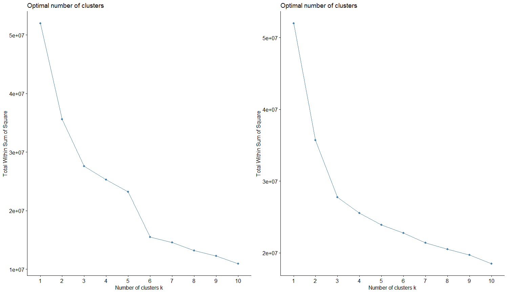
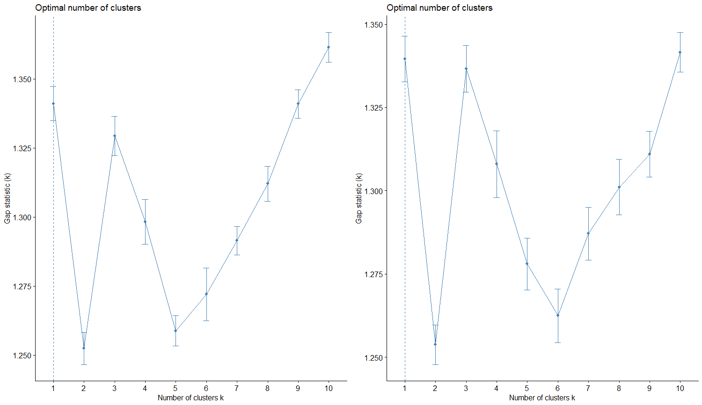
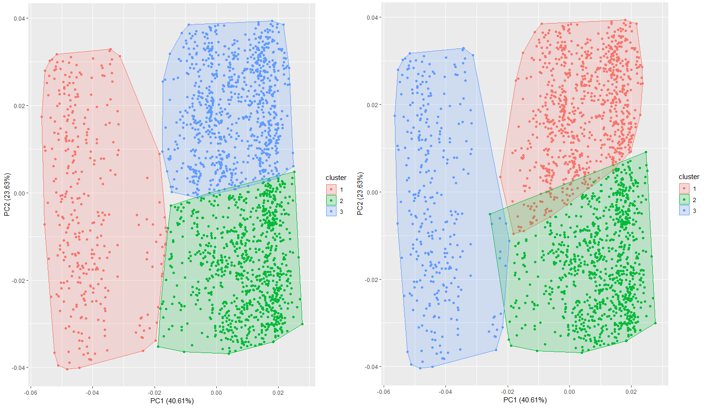

```{r setup, include=FALSE}
knitr::opts_chunk$set(echo = TRUE)
library(OpenML)
library(factoextra)
library(NbClust)
library(cluster)
library(dplyr)
require(ggfortify)
data <- getOMLDataSet(36)
data_X <- data$data %>% select(-c(class, region.pixel.count))
set.seed(27)
kmean <- kmeans(data_X, 3)
set.seed(27)
kmed <- pam(data_X, 3)
```

– Gigi, możemy zajść do mnie na moment?

Na policzkach Agnieszki wykwitł lekki rumieniec. Kiedy po spotkaniu ich byłej klasy z liceum Kamil zaproponował Agnieszce odprowadzenie jej do domu ("Czekaj, Gigi, też idę w tym kierunku!"), Agnieszka miała nadzieję na jakiś odważny krok ze strony kolegi. Nie nastawiała się, Kamil nie krył się z tym, że umawia się z kimś w tym swoim Gdańsku, ale nadzieja Agnieszki nie potrzebowała rozsądnych przesłanek.

W tym samym czasie Kamil spojrzał na Agnieszkę, oczekując odpowiedzi.

– Jesteś cała czerwona! – spostrzegł.

Szybkim ruchem schowała za sobą sierp.

– To z gorąca – zbagatelizowała. W rzeczy samej, opadające płatki śniegu szybko topniały, zetknąwszy się z nagrzanym podłożem. – Zajdźmy, masz trochę wody? Zimnej – dodała.

Ton głosu Agnieszki powstrzymał Kamila od analizowania treści komunikatu.

***

Szczęknięcie klucza otworzyło zamek.

– Jak?... Jak otworzyłeś drzwi bez włożenia klucza do zamka?... – odezwała się zszokowana Gigi.

– Każdy klucz wydaje specyficzne dźwięki, których częstotliwość zależy od kształtu ząbków – odparł Kamil. – Zainstalowałem więc urządzenie, które rozpoznaje dźwięk mojego klucza i automatycznie otwiera bądź zamyka drzwi.

– Ty? – zareagował przechodzący właśnie włamywacz, niosący w rękach część kina domowego Kamila. – To Rudy Bo zakładał ten system, robiąc rekonesans w Twoim mieszkaniu.

Kamil skrzywił się, musiał jednak przyznać włamywaczowi rację. Wprawdzie nie pamiętał niczego o części związanej z rekonesansem, zrzucił to jednak na karb roztargnienia.

Po wejściu do mieszkania wyjął szklankę, nalał wody i wrzucił dwie kostki lodu. Spojrzał w kierunku Agnieszki, która zdążyła rozłożyła się na sofie, wyrzucając jedną nogę wysoko na oparcie.

– Jestem taaaka rozpalooona!... – zamruczała ponętnie i machnęła ogonem.

Kamil spojrzał na szklankę i dorzucił jeszcze trzy kostki.

***

– To było takie męskie!... – stwierdziła Gigi, opróżniwszy już czwartą szklankę pełną lodu. – To może przejdziemy do tego, po co tu przyszliśmy? – Zatrzepotała rzęsami. Pięć godzin później przez Arizonę przeszedł niespodziewany, potężny huragan.

– Gigi, ponoć umiesz analizować dane.

Agnieszka przekrzywiła głowę.

– Umiem dużo i z chęcią ci to pokażę...

– To świetnie, bo jest taki problem. – Kamil sięgnął po średniej wielkości pudełko i otworzył je. Agnieszka zerknęła do środka.

– Czy to brokat? – zapytała.

Kamil roześmiał się. Miał perlisty śmiech, niczym te perły rzucane przed wieprze. Jego równiutkie, śnieżnobiałe zęby oślepiały wręcz odbijanym światłem. Piękno tego uśmiechu było wręcz...

– Ależ skądże, to piksele. – Odpowiedź chłopaka oderwała Gigi od narracji. A poza tym to Kamil wcale nie miał takich równych i śnieżbiałych zębów i zaklinanie rzeczywistości tego nie zmieni. – Miałem siedem zdjęć do pewnej pracy, ale ktoś – spojrzał wymownie na krasnoludka pieczołowicie wybierającego po jednej skarpetce od pary – wziął i pokruszył je na drobne kawałeczki.

– A co ja mam do tego?

– Może twoje techniki analizy danych pozwoliłyby złożyć z tych pikseli oryginalne zdjęcia? Nawet nie muszą być idealne, nie musi być ich siedem – dodał.

***

Agnieszka raz jeszcze przebiegła wzrokiem kod na monitorze.

```{r, eval=FALSE}
fviz_nbclust(x = data_X, kmeans, method = "wss")
fviz_nbclust(x = data_X, pam, method = "wss")

fviz_nbclust(x = data_X, kmeans, method = "silhouette")
fviz_nbclust(x = data_X, pam, method = "silhouette")

fviz_nbclust(x = data_X, kmeans, method = "gap_stat")
fviz_nbclust(x = data_X, pam, method = "gap_stat")
```

Kombinacją klawiszy wykonała jego część.



– Popatrz. – Agnieszka dotknęła palcem monitora. – Jak by nie patrzeć, to będą trzy albo sześć zdjęć. Nijak nie wychodzi siedem.

Kamil zamrugał.

– Chodzi o łokieć. Widzisz, tutaj jest biceps – wskazała lewą stronę wykresu – a tutaj przedramię – wskazała dolną część. – Oczywiście nie tak spektakularne, jak twoje.

Kamil przyłożył lewą rękę do ekranu. Pasowała, ale te trzy albo sześć... Nie rozumiał tego. Przecież zdjęć było siedem.

– A jakąś inną metodą? – zapytał, licząc na inne wyniki.

– Oczywiście, misiaczku. Popatrz tutaj.

Spojrzał, ale ekran był biały.

– Długo się liczy – rzekła Gigi na wpół przepraszająco, na wpół z ekscytacją w głosie. – Przez ten czas możemy zrobić... coś, cokolwiek innego. – Mrugnęła okiem.

– Właśnie, ostatnio skomponowałem utwór! Chcesz posłuchać?

Zachwycona Agnieszka kiwnęła tylko głową. Niestety, Kamil miał bułgarskie korzenie i opacznie zinterpretował gest Agnieszki. Zawiedziony westchął i, chwilę później, skonstatował tylko:

– Chyba już.

Gigi nie rozumiała zachowania Kamila.

– Policzyło się – doprecyzował.



Spojrzała na ekran. W rzeczy samej.

– A. To... szukasz maksimum. To będzie... jeden. Jedno zdjęcie. Albo trzy. Trzy, koniecznie, jedno nie ma sensu w tym kontekście. Możemy złożyć trzy zdjęcia z tych pikseli. – Gigi próbowała zawrzeć jak najwięcej entuzjazmu w swoim głosie – Co o tym sądzisz?

– Dobrze. To ty tu rządzisz.

Agnieszka poprawiła swoje insygnia królewskie.

– Właściwie zrobiłam jeszcze dwa wykresy, ale nie są tak wiarygodne jak te wyżej, więc możemy je zignorować. Masz je zapisane na dysku, tak na pamiątkę.

***

Dziesięć minut później Agnieszka zaprezentowała Kamilowi ciąg liczb.

– No i co z nimi? – zapytał.

– Jak to co? Mamy podziały na zdjęcia! Czekaj, zaraz to narysuję.



– Ładne kolory – stwierdził Kamil. – Ale jak nam to pomoże?

– To jest właśnie podział na zdjęcia. Jak widzisz, całkiem dobry. A tak swoją drogą, skąd miałeś dane o tych pikselach na komputerze?

Kamil wzruszył ramionami i odparł:

– Imperatyw Narracyjny. Inaczej cała fabuła by się załamała, gdybyśmy mieli opisywać każdy piksel z osobna.

Agnieszka mogła tylko przytaknąć.

– Dlaczego są dwa wykresy? – zapytał chłopak.

– Bo wzięłam dwie metody. W sumie nie wiem, która jest lepsza.

– Są trzy te, klastry. Obie są takie sobie. Powinno być siedem.

– Tylko że siedem zdjęć wyszłoby ci źle podzielonych – zripostowała Gigi. – Na trzy działa o wiele lepiej.

– To ta, gdzie są lepiej podzielone. Nie wiem, porównaj ich rozdzielenie czy coś... – zaproponował. – Ten po lewej wygląda na mniej nachodzący na siebie.

Agnieszka westchnęła. Seksowny, ale mogłaby go trochę poduczyć w tej materii.

– Tylko, widzisz, nie tylko o to chodzi. Jest wiele miar opisujących jakość klastrowania.

– Chcesz brandy? Bez wspomagania to nie wejdzie.

Agnieszka miała już kiwnąć głową, ale zamiast tego przytaknęła. Alkohol był zbieżny z jej celami.

***

– Popatrz, porównałam centra klastrów – zawołała Gigi.

```{r, echo=FALSE}
knitr::kable(kmean$centers)
knitr::kable(kmed$medoids[3:1, ])
```

Kamil przekrzywił głowę.

– Dużo liczb. Moja nie rozumieć. I te tabelki wyjeżdżają gdzieś za ekran. Mogłyby nie?

Tabelki zgasiły silnik samochodu i wypakowały walizki. Znów nie będą mogły pospacerować po pięknych zimowych Bieszczadach.

– Dość dobrze widać, który z podziałów jest lepszy – improwizowała Agnieszka. – Z tych liczb wychodzi to bardzo wyraźnie. Choćby, o! – machnęła palcem w ogólnym kierunku tabelki – ta kolumna pokazuje, który algorytm korzysta z większej ilości danych. A nie chcemy algorytmów, które ignorują część danych.

Zdawała sobie sprawę, że nieobeznany w temacie Kamil łyknie jej uzasadnienia równie gładko jak przełyka ślinę. Te liczby same w sobie nie pomagały jej porównać algorytmów, ale szczegóły klastrowań były jej fetyszem. Jedną z niewielu rzeczy, które pociągały ją w stopniu zbliżonym do Kamila. No i mogła je mieć na zawołanie.

– Mam jeszcze jeden wykres.

```{r, echo=FALSE}
diff <- kmean$cluster - (4 - kmed$clustering)
df <- data.frame(sum = c(sum(diff == 2), sum(diff == 1), sum(diff == -1), sum(diff == -2)),
                 label = c("diff_plus2", "diff_plus1", "diff_minus1", "diff_minus2"))
ggplot(df, aes(y = sum, x = label)) +
  geom_bar(stat = "identity")
```

– Może po prostu powiedz, które klastry są lepsze – stwierdził zrezygnowany Kamil. – Mam nadzieję, że chociaż tobie pomagają te statystyki.

"Pomagają na różne sposoby", pomyślała Gigi.

– To nie są duże dane – zaczęła – więc nie ma powodu bawić się w wybieranie szybszego algorytmu, możemy wziąć najlepszy. A te wszystkie statystyki, które widzieliśmy wcześniej, pokazują dobitnie jedną rzecz. Krzyczą wręcz. – Tutaj zawiesiła głos. Kamil w reakcji podniósł brew. – Obydwa algorytmy poradzą sobie dobrze. Tylko k-średnie trochę lepiej. Choć, szczerze mówiąc, chyba wzięłabym tutaj jakieś klastrowanie hierarchiczne.

– To dlaczego nie wzięłaś? – błyskotliwie spostrzegł Kamil.

– Ten twój Imperatyw Narracyjny. Dał dane, ale nie pozwolił użyć innych klastrowań. Coś za coś. – Zawiesiła głos na moment. – Proszę, korzystaj. Nie wiem, jak zamierzasz teraz połączyć te piksele, ale instrukcję już masz.

– Jak mogę się zrewanżować?

– Wiesz... – uśmiechnęła się Gigi.

Kilkanaście godzin później, w środku nocy, w jednym mieszkaniu na Mokotowie wciąż było słychać odgłosy przesuwanych pikseli.

***

– Ej, a właściwie to dlaczego studiujesz w Gdańsku, a mieszkasz w Warszawie? – zapytała Agnieszka.

– Daj spokój, fabuła już się skończyła – odparł Kamil z niezadowoleniem.

– A kiedy się prześpimy? – dociekała?

– To jest otwarte zakończenie z niedopowiedzeniami. Nie da się odpowiedzieć na takie pytanie.

– Zaczynasz gadać jak narrator!

Wcale nie.
